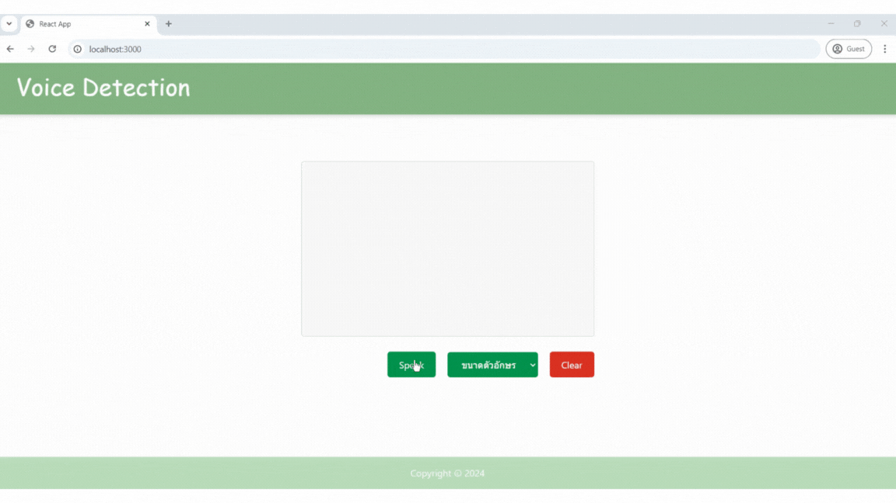
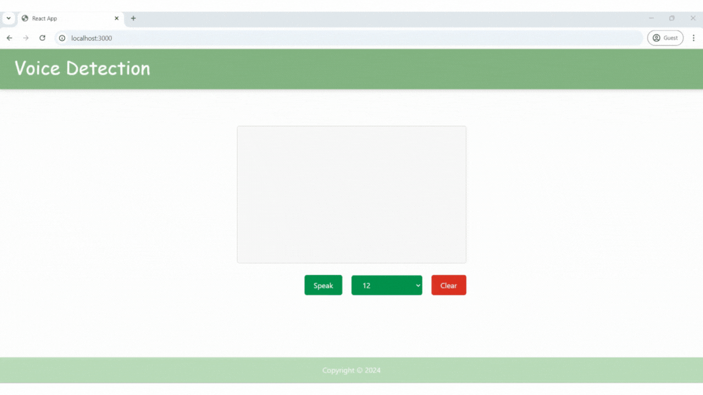
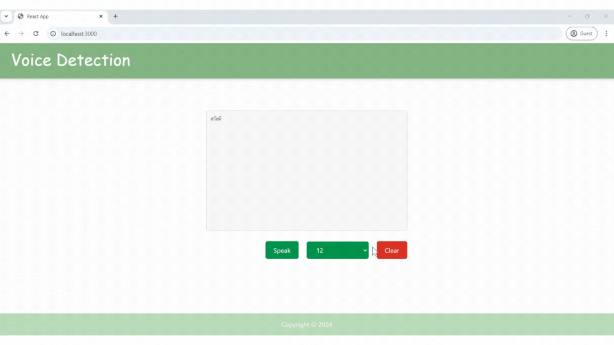
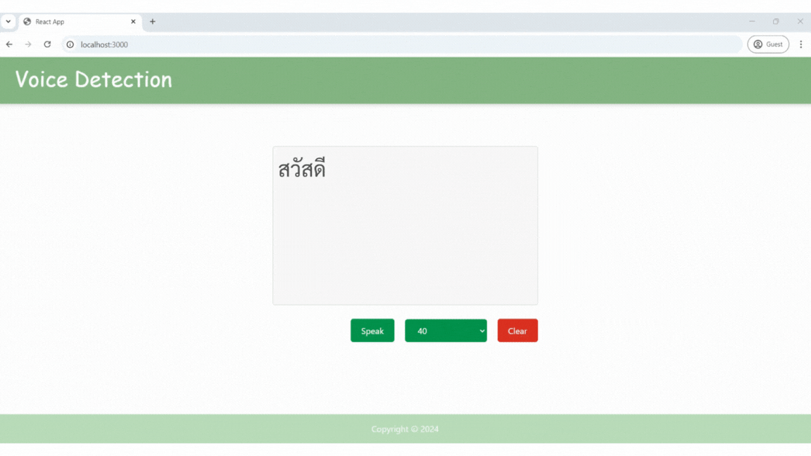

# Voice-Detection-App
## Try Damo
**You can try out the website at this link : https://voice-detection-app.onrender.com/**

## About the website
This website serves as a learning project demonstrating the integration of React JS with the Web Speech API. Its primary focus is on speech-to-text functionality, enabling users to communicate through voice input which is then transcribed into text.

## How to use and what you need
* The index.js file uses one main libraries:
   * **Alert**: A library facilitating straightforward user notifications.

* To use the website, you will need the following:
   * **React** 
   * **Node.js**
   * **Node Package Manager (NPM)**

## Basic usage
1. After installing `Node.js`, open a terminal and install NPM with the command `npm i`.
2. Start the server with the command `node index.js`. If the server starts successfully, you will see the message "**Server running on port 3000**".
3. After starting the server, access the website at the URL: `http://localhost:3000/`.
4. To stop the server, press **`Ctrl+C`**.

## Introduction to the website
The website necessitates user vocal input to transcribe spoken language into written text. Both the spoken input and transcribed output are exclusively in Thai. Furthermore, the text size can be adjusted to accommodate user preferences.

## Website details

Upon accessing the website, users will be greeted with a clean and user-friendly homepage, featuring a speech-to-text conversion function as its primary feature:

Before using the speech-to-text function, users are required to select a desired font size to ensure clear and readable output. If no font size is selected, the system will display an error message to prompt the user to complete this step:

After selecting the font size, users can click the "Speak" button to start recording their voice. The system will process the recorded audio and display the transcribed text on the screen in real-time:

Users can adjust the font size at any time to suit their preferences:

To clear the transcribed text, users can click the "Clear" button:

### Postscript
This project was developed specifically to practice using the Web Speech API. The developer hopes that this project will be beneficial to those interested in learning and developing web applications. The developer would like to thank everyone who has visited this project and invites you to share your feedback to help improve it further.
